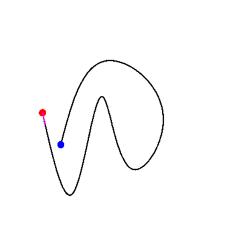
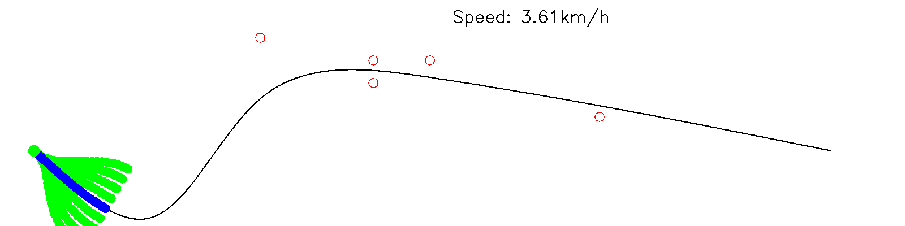

# PaC
PaC: Planning and Control algorithms written in C++.

## Algorithms

### PID

### Pure Pursuit

### DWA

### Quintic Polynomial Planner

### Bezier

### Frenet Optimal Trajectory

## Build

`mkdir build && cd build`

`cmake ..`

`make -j`

## Run

Executables can be found in `bin/` folder after build process.